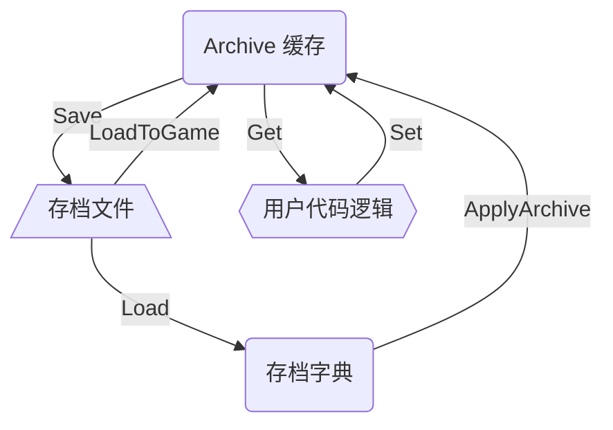

# `Archive` - 存档系统

`Archive` 提供一个便捷的、基于字典的存档系统，使用相当简便的代码即可实现读写操作。  


## 快速使用

以下示例演示了如何使用 `Archive` 进行读写操作：

```C#
// 加载第 0 号存档
Archive.LoadToGame(0);

// 将数值存入存档
Archive.Set("health", 30); 

// 从存档读取数值，如果不存在，则使用第二个参数作为默认值
Archive.Get("mana", 100); 

// 保存第 0 号存档
Archive.Save(0);

```


## 结构概览

`Archive` 具有如下结构：



其中，核心结构 `Archive` 内部封装了一个 `Dictionary<string, object>` 作为缓存。


## 使用方法

### 基本

在游戏开始，或者玩家下达了“读取存档”的指令时，使用 `Archive.LoadToGame(index)` 加载指定存档进入**缓存**。
`index` 指定存档的序号，可以以此实现多存档系统。  

读取存档后，使用  
- `Archive.Get(key, defaultValue)` 从缓存中读取内容， 
- `Archive.Set(key, value)` 将数据写入缓存中， 

最后，在需要保存时，使用 `Archive.Save(index)` 将缓存中的数据保存到指定存档中。

```C#
// 加载第 0 号存档
// 如果你只需要一个存档，那么此处可以硬编码为 0 
// 如果需要实现多存档，则控制此处的 index 即可
Archive.LoadToGame(0);

// 此处的最佳实践是使用常量，而非硬编码 key
Archive.Set("health", 30);    

// 读取存档中的 Health 字段，如果不存在，则返回 100
// 类型通过默认值 100 自动推断为 int
var health = Archive.Get("health", 100);   

// 保存第 0 号存档
Archive.Save(0);

```
  
### 键值管理

`Archive` 提供了一些 API，用于管理当前缓存中的内容：
- `Archive.Has(key)` 判断缓存中是否存在指定的键。
- `Archive.Remove(key)` 删除缓存中指定的键值对。
- `Archive.Clear()` 清空当前的缓存。

除此以外 `Archive` 还提供了 `Archive.Load(index)`，允许直接读取存档字典，而不将其装载入缓存中。  
一个常见的应用场景是实现 **存档预览** 功能：
```C#
// 判断存档是否存在，并将其部分信息展示给玩家
for(int i = 0; i < 5; i++)
{
    if(!Archive.HasArchive(i)) continue;
    var datas = Archive.Load(i);

    // 向玩家展示存档信息的方法，需要自行实现
    DisplayArchiveInfo(i, datas.Get("name", "未命名存档"));
}
```  

如果你希望在 `Archive.Load(index)` 之后，不进行第二次读取-解析，直接将获得的字典装载入缓存中，可以使用 `Archive.ApplyArchive(datas)`，从而提高效率。


::: tip
尽管 `Archive.Set(key, value)` 相当方便，但并不建议使用它存储**数组、列表、字典**等复杂数据结构。  
这是 JSON 序列化无法通过 `Dictionary<string, object>` 推断类型导致的。  

要存储这些数据类型，请参考 [`DataStore`](./1-archive#datastore)
:::

 

### 文件管理

`Archive` 将存档文件存储于 `{Application.persistentDataPath}/Save/save_{index}.json` 中。  
同时，`Archive` 提供了如下 API：
- `Archive.HasArchive(index)` 判断第 `index` 号存档文件是否存在。
- `Archive.Delete(index)` 删除第 `index` 号存档文件。
- `Archive.Clear(index)` 清除第 `index` 号存档的内容，但不删除文件。

当调用 `Archive.LoadToGame(index)` 或 `Archive.Load(index)` 时，如果该存档文件不存在，则会自动创建一个空文件。
这样，在加载存档的时候，可以直接通过 `Archive.HasArchive(index)` 判断这个存档是否曾经加载过了。

::: warning
`Archive.Clear()` 与 `Archive.Clear(index)` 形式很像，但作用不同。  
`Archive.Clear()` 会清空当前**缓存**，但不会修改存档文件的内容。  
`Archive.Clear(index)` 会清空第 `index` 号存档文件的内容，但不会修改**缓存**。
:::

 

### 事件

`Archive` 提供了一系列事件，允许你在某些时机执行更多的操作：
- `Archive.Saving` 在缓存即将写入存档文件时触发。可以在这一时机向缓存添加更多的内容。
- `Archive.Saved` 在缓存写入存档文件后触发。
- `Archive.Loaded` 在存档文件**读入缓存**时触发。可以在这一时机进行初始化等操作。

 

### `DataStore`

`DataStore` 是一种按照自定义规则读取、解析、写入存档的数据结构。  
他允许更方便、更可靠地读写 `Archive` 存储的复杂数据结构，如数组、字典等。  

`Archive` 提供了 `DataStore` 抽象类和若干常用的 `DataStore` 实现：
- `DataStoreList<T>` 自动读写一个 `List<T>`。
- `DataStoreSet<T>` 自动读写一个 `HashSet<T>`。
- `DataStoreDict<V>` 自动读写一个 `Dictionary<string, T>`。
- `DataStoreDictList<V>` 自动读写一个 `Dictionary<string, List<T>>`。
- `DataStoreDictDict<V>` 自动读写一个 `Dictionary<string, Dictionary<string, T>>`。

::: details `Dictionary<string, Dictionary<string, T>>` 是什么鬼？
曾经有一个非常神奇的需求，是这样的：  
> 有一部电梯，每一层楼都有独立的权限机制，限制玩家仅能前往指定的楼层  
> 不仅如此，当玩家按下不同楼层的按钮时，还需要依据该按钮是 **正常** **按了没反应** 或 **被破坏** 等状态进行视觉表现和对话剧情上的区分  
> 因此，`Dictionary<string, Dictionary<string, T>>` 被用于存储：  
> **当前楼层 `string`** -> **目标楼层ID `string`** -> **楼层按钮状态 `T`**
:::

<br/>

以下示例展示了如何使用 `DataStoreDict` 存储玩家的背包：
```C#
// 创建 DataStoreDict 对象
// 构造函数中的字符串是 Archive 存储使用的键
// 注意：由于存档缓存是单例，故 DataStore 也应当以静态单例的形式存在 // [!code highlight]
private static DataStoreDict<int> inventory = new("inventory");

// DataStore 在读取存档时会自动加载其中的目标内容
Archive.LoadToGame(0);

// DataStore 在数据结构外封装了一层，因此需要如此调取实际字典
foreach(var kv in inventory.Dict) {
    Debug.Log($"物品 {kv.Key} 有 {kv.Value} 个");
}

// 保存存档
// DataStore 会在存档保存时自动存入最新的值
Archive.Save(0);
```

<br/>

你也可以拓展 `DataStore` ，从而实现你所需要的特殊数据结构的存储。  
以下是 `DataStoreList<T>` 的关键源码，作为参考：
```C#
public class DataStoreList<T> : DataStore
{
    // DataStore 内部封装的列表，是实际存储数据的结构
    protected List<T> list;

    // 构造函数，不需要做任何事情
    public DataStoreList(string key) : base(key) { }

    // 重载的 Save() 函数，需要在此处将 list 存入存档
    // DataStoreList 将列表再次序列化后，作为字符串存入 Archive 缓冲中
    protected override void Save() { base.Save(); Archive.Set(key, JsonMapper.ToJson(list)); }

    // 重载的 Load() 函数，需要在此处从 Archive 读取并还原 list
    // 注意：base.Load() 必须在数据提取完毕后再调用！
    protected override void Load()
    {
        list = JsonMapper.ToObject<List<T>>(Archive.Get(key, "")) ?? new List<T>();
        base.Load();  // [!code highlight]
    }

    // 打印当前存储的数据，用于 Debug
    public override void PrintContent()
    {
        StringBuilder sb = new($"列表 {key}: 长度 {list.Count}\n");
        list.ForEach(i => sb.Append($"{i}\n"));
        Debug.Log(sb);
    }
}
```

 

### 自定义解析器

有时候，你可能需要改变默认的 JSON 解析行为，使用你自己的数据解析逻辑。  
`Archive` 提供了 `Archive.RegisterParser<T>(prefix, importer, exporter)` 来实现这一功能。  

以下是解析 `Vector2` 的自定义解析器示例。这个解析器已经默认注册到 `Archive` 中，因此你不需要将这段代码重复一遍。
```C#
// "v2" 作为标记，标明这是一个 Vector2 类型的值
// 存储在 JSON 中的所有 Vector2 将以 "$v2:" 开头的字符串形式存在
RegisterParser<Vector2>("v2",   
                  s =>
                  {   // 解析逻辑，在 JSON 解析过程中检测到 "v2" 前缀时触发
                      // 传入的 s 是读取到的字符串，已经将前缀去除了
                      var parts = s.Split(',');
                      return new Vector2(float.Parse(parts[0]), float.Parse(parts[1]));
                  },
                  obj =>
                  {   // 序列化逻辑，在 JSON 序列化过程中触发
                      // 传入的 obj 是需要序列化的 Vector2 对象
                      var vec = (Vector2)obj;

                      // 返回的字符串将会再次被添加 "v2" 前缀存入 JSON 中
                      // 在这个例子里，Vector2 将以 $v2:x,y 的形式存储
                      return $"{vec.x},{vec.y}";
                  }
);
```

 

### Debug

你可以随时使用 `Archive.PrintContent()` 查看当前存档**缓存**中的所有值。  
同时，`DataStore.PrintContent()` 可以查看指定 `DataStore` 中存储的数据。